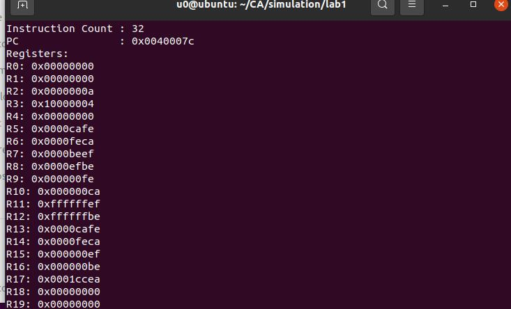

在本次实验中，我们完成了 32 位 MIPS 常见指令集的模拟执行过程。

**相关链接**

本次实验源码详见链接[lab1](https://github.com/U0Ghost/NKU23CA-experiment)

# 实验流程

**构建模拟环境并转化机器码**

实验中，我们需要在linux环境下利用spim模拟器转化机器码，这个过程中需要修改asm2hex文件，使得能正常调用Qtspim模拟器，经一番周折与配置，我们成功获取了给出的所有input文件的机器码并保存为.x文件。同时，有一些汇编指令出现了溢出，spim帮我们做了效果相同的其他指令的替代。(下图的69行)


**模拟实验过程**

实验的shell.c文件构建了一个终端用于读入并执行控制台输入的一系列命令，包括，而sim.c实则完成了其中的一个函数process_instruction()用于处理指令。

对作用过程的更深入理解，我们需要阅读shell.c和shell.h文件。

模拟过程首先执行main函数，其中在go()和run()两个函数中调用了cycle()，模拟了指令的执行流。

程序定义了一个CPU状态的结构体，内部存储了pc、32个寄存器和用于乘除法的HI和LO两个特殊寄存器：
```c
typedef struct CPU_State_Struct {

  uint32_t PC;		/* program counter */
  uint32_t REGS[MIPS_REGS]; /* register file. */
  uint32_t HI, LO;          /* special regs for mult/div. */
} CPU_State;
```
以及两个CPU状态CURRENT_STATE, NEXT_STATE。

在cycle()函数中可以看出，程序先执行指令处理函数process_instruction()，然后将下一CPU状态赋值给当前CPU状态，指令计数器+1，完成了一个周期的工作。

这里需要注意的是，reg寄存器里面的类型是uint32_t为无符号数，在处理指令过程中需要区分有无符号，即进行有符号的比较时需要进行强制类型转换。

因此接下来我们的工作就是补全指令处理函数。

# **指令处理函数的编写** #

指令执行过程中，先调用mem_read_32()获取指令对应的机器码。

再对机器码执行处理，先把一条32位指令按指令类型分解成多个指令字段，再按照指令的类型进行分类，进行不同case下的执行。

本次实验中，我们按字段大小排序完成了各个指令的编写。下面结合几个指令说明需要注意的点和遇到的问题。

- mem_read_32() 注意参数地址是32位，而立即数加载的数是16位。

- addiu 不检测溢出（u不代表无符号数，而是不检测溢出） 由于加的立即数过大，超出了16位有符号数的表示范围，qtspim会帮我们将这些导致溢出的addiu指令转换为ori指令，同时保证其运算结果在不检验溢出的情况下的正确性。**同时需要采用符号扩展！**

- syscall 在本次实验中，只需要实现值为0xA时，调整RUN_BIT=0结束模拟的过程。

- lbu 从指定位置内存中加载一个字节（8位），并将其零扩展为32位，然后存储在寄存器rt中，注意地址是基地址Base+偏移量Offset。这里采用位运算将取出的32位按位与上0xff即获得了我们需要的字节。其他的加载操作同理。

- sb 将寄存器rt中的最低字节存储到内存中的指定地址。与读取指令同理，但这里我们需要把原地址数据的其他不需要存储的位保留，因此需要读取原地址数据，按位与获取其余不需要存储的位，和需要存储的值按位或拼接起来，存回原来的位置。

- 分支和跳转指令。因为处理器按照字节寻址,二指令存储器每个地址是一个32bit字,所以要给指令中的立即数乘4,即左移两位。在判断完满足条件跳转后，带AL的指令还需要将下一条指令的地址存储到31号寄存器。

除了分支和跳转指令之外，其他指令执行完后PC值都会增加4，我们封装了一个函数pc_add()来执行这条指令。

# **仿真验证** #

我们可以通过在控制台输入rdump返回所有储存的寄存器的内容，mdump返回内存中的内容，以此验证是否对应的机器码都可以成功执行。

首先是算术语句的两个样例。

- 模拟addiu的结果，可以看出都正常执行了addiu和syscall语句。


- arithtest的结果，依照汇编语句的运算顺序和结果正常执行了，其中的一些运算如上文Qtspim进行了等价代替。


然后是分支测试。我们以第一个样例brtest0为例进行解释。

- 如图，按照语句的语义执行的结果，指令流应该是进行了如图的跳转，在bne处判断条件不成功，因此不做跳转。


- 执行的结果，正常执行了对应的语句并在寄存器R7中存储了正确的值0xd00d。

执行的结果，正常执行了对应的语句并在寄存器中存储了正确的值。

brtest1和brtest2如下。

- brtest1：在R5中存储了对应的值0xbef01a5e，过程中也正确进行了每一步的运算，保存了合理的ra值，说明成功正确运行到了正确的结尾。


- brtest2：执行成功时在R7中存储了0xd00d。


然后是访存的两个样例。

- 第一个样例test0的执行结果如下，R17存储的值为0x881d。


- test1主要是取半字和取字节，最终在寄存器中都存储了相应的值进行对应，正确运行了结果。



# 小结 #

本次实验我们在一个shell框架下，完成了对应的mips指令集的简单复现，同时结合了测试用例进行了简单的逻辑测试，不仅锻炼了阅读一个新框架和项目的能力，也学习了更多的mips指令集的实现细节，收获颇丰。